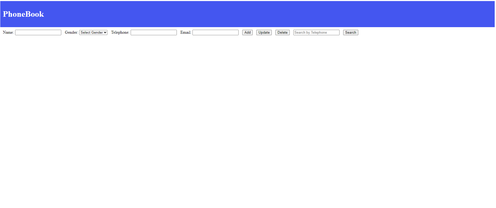

# Phonebook Management Application

This Python-based Phonebook Management application provides a user-friendly way to store, manage, and retrieve your contacts.  It's designed to be a personal digital rolodex, helping you keep track of important connections with ease.

## Key Features

**Effortless Contact Storage:** Add, edit, and delete contacts through a clean and intuitive interface. Contact information is stored securely.
**Powerful Search Capabilities:** Quickly find contacts using search functionality.  You can search by name, phone number, or email.
**Responsive Design:** The application adapts to different screen sizes, providing a consistent experience across desktops and mobile devices.
**Persistent Data Storage:** Contact data is stored locally in the browser's storage, ensuring data persistence across sessions.
**Simple User Interface:** The application has a simple user interface, making contact access and management easier.

## Why Use This Application?

In today's fast-paced environment, staying organized is essential. This application is ideal for individuals, small businesses, and anyone who needs a reliable way to manage their contacts.  Your data is stored locally on your PC.

## Output Image

**Explanation of the Output Image:**

The image above shows the main screen of the Phonebook application.  Here's a breakdown:

**Title:** The title "PhoneBook" clearly indicates the application's purpose.
**Data Fields:** The fields "Name", "Gender", "Telephone", and "Email" represent the contact information that can be stored and managed by the application.  These fields allow users to input and view specific details for each contact.
**Buttons:** The buttons "Add", "Update", "Delete", "Search by Telephone", and "Search" provide the core functionalities of the application.
    * "Add" is likely used to create a new contact entry.
    * "Update" allows modification of existing contact details.
    * "Delete" removes a contact from the phonebook.
    * "Search by Telephone" and "Search" enable users to find specific contacts based on different criteria.

This simple and direct interface allows users to quickly understand and interact with the phonebook's features.

## Usage

This application provides simple and intuitive ways to manage your contacts:

**Adding a Contact:**

1.  Enter the contact's information in the "Name," "Gender," "Telephone," and "Email" fields.
2.  Click the "Add" button.
3.  The contact will be saved to the phonebook.

**Editing a Contact:**

1.  Search for the contact you want to edit (see "Searching for a Contact" below).
2.  The contact's information will likely be displayed in the "Name," "Gender," "Telephone," and "Email" fields.
3.  Modify the information in the fields as needed.
4.  Click the "Update" button to save the changes.

**Deleting a Contact:**

1.  Search for the contact you want to delete (see "Searching for a Contact" below).
2.  The contact's information will likely be displayed.
3.  Click the "Delete" button.
4.  The contact will be removed from the phonebook.

This application stores data locally, so changes are saved within your browser's storage.

